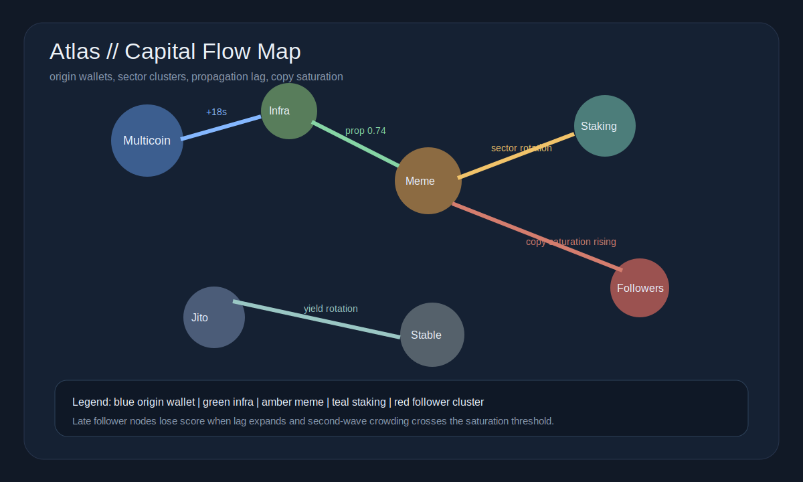
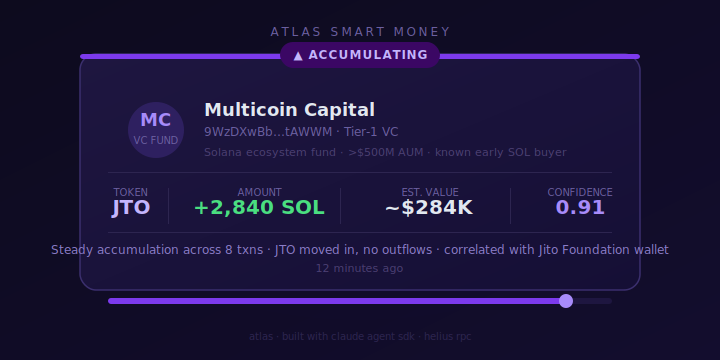

<div align="center">

# Atlas

**Solana capital-flow mapper.**
Tracks origin wallets, follower propagation, and sector rotation across the on-chain graph.

[](https://github.com/AtlasOnchain/Atlas/actions)

[](https://docs.anthropic.com/en/docs/agents-and-tools/claude-agent-sdk)
[](https://www.typescriptlang.org/)

</div>

---

The edge in wallet intelligence is not seeing that a large wallet moved. It is knowing whether that wallet was first, whether others are copying it, and whether capital is rotating across sectors or simply shuffling inside the same bucket.

`Atlas` tracks a curated wallet set, fetches recent Helius activity, infers sector exposure from token movement, and asks a Claude agent to emit capital-flow alerts framed around origin, propagation, and distribution.
The emphasis is on who led the flow and whether the rest of the graph is still early or already crowded.

`SCAN -> MAP MOVES -> INFER SECTOR -> SCORE PROPAGATION -> ALERT`

---

Flow Map • Flow Alert • At a Glance • Operating Surfaces • How It Works • Example Output • Technical Spec • Risk Controls • Quick Start

## At a Glance

- `Use case`: track who moved first and whether the rest of the wallet graph is following
- `Primary input`: origin wallets, propagation lag, size similarity, sector overlap, crowding
- `Primary failure mode`: confusing copied flow with fresh leadership
- `Best for`: operators who care about whether on-chain capital movement is still early

## Flow Map



## Flow Alert



## Operating Surfaces

- `Flow Map`: shows the current shape of the wallet graph and sector movement
- `Flow Alert`: prints whether a move is originating, propagating, rotating, or distributing
- `Propagation Model`: separates leaders from the second wave
- `Crowding Lens`: downgrades signals once too many followers pile into the same path

## Why Atlas Exists

Raw wallet tracking is too flat. It tells you that a wallet moved, but not whether that move mattered, whether anyone followed it, or whether the graph is still early enough to act on.

Atlas exists to restore sequence and context to wallet flow. The useful question is not "who bought." The useful question is "who bought first, who copied after that, and is the signal getting stronger or more crowded?"

## How It Works

Atlas processes wallet flow in five steps:

1. ingest recent wallet actions from the tracked address set
2. infer the sector context around each move
3. compare later wallet actions to earlier ones for lag and size similarity
4. score whether the move is leading, propagating, rotating, or distributing
5. emit alerts only when the graph still looks early enough to matter

That is what turns wallet tracking into something interpretive instead of just observational.

## What A Strong Atlas Alert Looks Like

- a clear origin wallet moves first
- the second wave arrives inside the usable lag window
- sector overlap confirms the move is coherent
- follower saturation is still low enough that the graph is not crowded

Once those conditions break, the board should downgrade the alert.

## Example Output

```text
ATLAS // FLOW ALERT

origin wallet      multicoin
sector             infra
state              propagating
lag window         18s
propagation score  0.74
crowding           low

operator note: second wave is real, but the graph still looks early
```

## Technical Spec

Atlas treats a wallet move as a network event, not an isolated transfer.

Core propagation logic:

`PropagationScore = lagAdjustedFollowRate * sizeSimilarity * sectorOverlap`

Operationally:

- origin wallets matter more than follower wallets
- sector overlap matters because meme rotations behave differently from staking or infra rotations
- follower saturation decays the value of a copied signal once too many second-wave wallets pile in
- late propagation should be demoted if lag exceeds the configured window

The alert payload explicitly includes:

- `action`: originating, propagating, rotating, distributing
- `sector`: meme, infra, staking, stable-yield, or unknown
- `propagationScore`: bounded confidence about whether the move is leading or following the graph

## Risk Controls

- `lag window`: downgrades copied moves that arrive too late to matter
- `follower saturation filter`: penalizes crowded second-wave behavior
- `sector consistency check`: prevents unrelated token movement from looking like propagation
- `origin bias`: keeps the system focused on leadership instead of noisy copying

Atlas should miss some copied moves on purpose. Once the graph is crowded, the informational edge is already decaying.

## Quick Start

```bash
git clone https://github.com/AtlasOnchain/Atlas
cd Atlas && bun install
cp .env.example .env
bun run dev
```

## Configuration

```bash
ANTHROPIC_API_KEY=sk-ant-...
HELIUS_API_KEY=...
ALERT_MIN_CONFIDENCE=0.70
MIN_PROPAGATION_LAG_SECONDS=15
MAX_PROPAGATION_LAG_SECONDS=300
COPY_SATURATION_THRESHOLD=0.55
```

## Legitimacy Notes

- Planned commit sequence: [`docs/commit-sequence.md`](docs/commit-sequence.md)
- Draft engineering issues: [`docs/issue-drafts.md`](docs/issue-drafts.md)

## Support Docs

- [Runbook](docs/runbook.md)
- [Changelog](CHANGELOG.md)
- [Contributing](CONTRIBUTING.md)
- [Security](SECURITY.md)

## License

MIT

---

*map who moved first, not just who moved big.*
